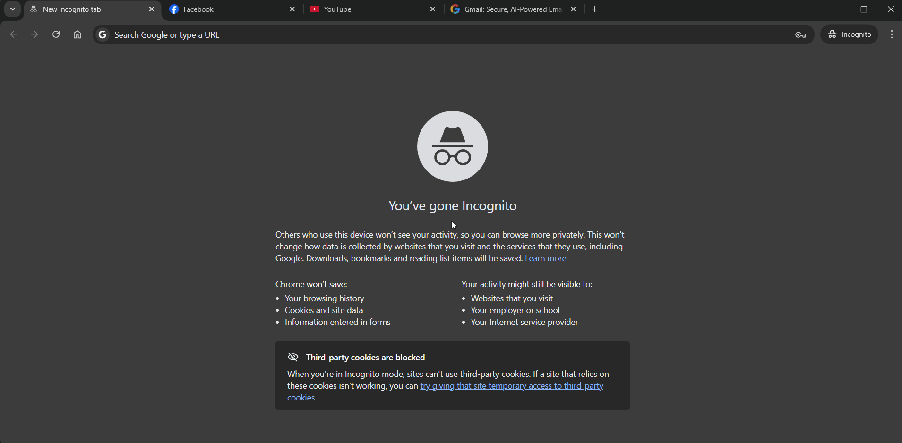

# TabScroll 🖱️

**Switch browser tabs instantly with your mouse wheel — no keyboard, no extensions.**

Hold Right Click + Scroll to navigate tabs in Chrome, Edge, Firefox, VS Code, and more.  
Portable. No installation. No admin rights required.




---

## How It Works

| Gesture | Action |
|---|---|
| Hold `RButton` + Scroll Up | Next tab (→) |
| Hold `RButton` + Scroll Down | Previous tab (←) |
| Hold `RButton` + No scroll | Normal right-click menu |
| Scroll without `RButton` | Normal page scroll |

---

## Features

- **Mouse-only gesture** — no keyboard shortcut needed
- **Intelligent intercept** — only activates in windowed, tabbed apps; passes through in fullscreen and games
- **On-Screen Display (OSD)** — sleek pill-shaped indicator shows direction and tab count
- **Scroll threshold** — adjustable sensitivity to prevent accidental switching
- **App blacklist** — exclude specific apps via `TabScroll.ini`
- **Start with Windows** — toggle auto-launch from the tray menu, no admin rights needed
- **Splash screen** — branded startup screen on launch
- **System tray integration** — pause, configure, or quit from the taskbar
- **Single instance** — re-running replaces the old instance automatically

---

## Installation

> ✅ **AutoHotkey is bundled** — you do not need to install anything separately.

1. Download `TabScroll.zip` from [Releases](https://github.com/minhhust2905/TabScroll/releases/latest)
2. Extract to any folder (Desktop, Documents, USB drive — anywhere)
3. Run `TabScroll.lnk`
4. *(Optional)* Right-click the tray icon → enable **Start with Windows**

---

## Supported Apps

Works with any windowed app that supports `Ctrl+Tab`:

`Chrome` `Edge` `Firefox` `VS Code` `File Explorer` `Windows Terminal` `Notepad++` `Sublime Text` `Figma` `Postman` and more.

> ⚠️ Does **not** activate in fullscreen or borderless-window mode (automatically bypassed).

---

## Configuration

TabScroll creates `TabScroll.ini` automatically in its folder on first run.

```ini
[Settings]
StartWithWindows = 0       ; 1 = launch on boot
ShowOSD          = 1       ; 1 = show OSD indicator
ScrollThreshold  = 1       ; notches required per tab switch (1–3)
Blacklist        = game.exe,photoshop.exe  ; one app per line in the GUI editor
```

All settings can also be changed from the tray menu without editing the file manually.

---

## Hotkeys

| Hotkey | Action |
|---|---|
| `Ctrl + Alt + P` | Pause / Resume |
| `Ctrl + Alt + Q` | Quit |

---

## Compatibility

| Scenario | Behavior |
|---|---|
| Fullscreen / borderless apps | Scroll passes through normally |
| Anti-cheat games (Vanguard, EAC, BattlEye) | Automatically blocked by anti-cheat; resumes after game closes |
| Razer Synapse / Logitech G Hub | May conflict — disable right-click assignments in mouse software |
| Antivirus flag | False positive — source code is fully open for inspection |

---

## Links

- 🌐 **Website** — [tabscroll.com](https://minhhust2905.github.io/TabScroll/)
- 📖 **Full Documentation** — [tabscroll.com/docs](https://minhhust2905.github.io/TabScroll/docs.html)
- 🐛 **Bug Reports** — [Open an issue](https://github.com/minhhust2905/TabScroll/issues)

---

## License

MIT © 2026 Minh Edward

> TabScroll hooks into Windows mouse and keyboard input at the system level.  
> This may conflict with anti-cheat software or security tools. Use at your own risk.  
> Full terms in [LICENSE](LICENSE).
